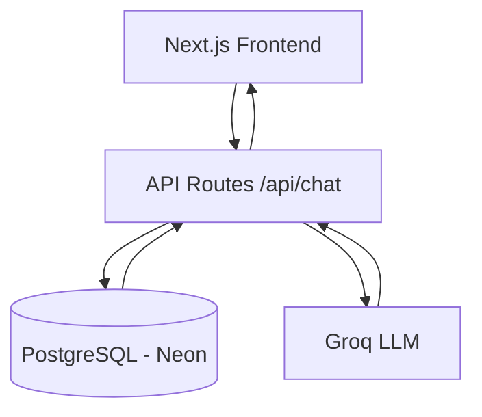
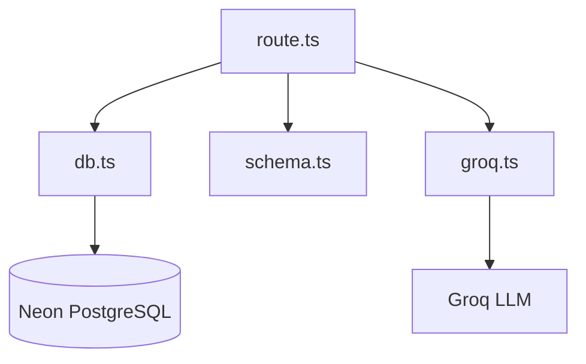

# Support-Core AI

An AI-powered customer support chat application built using **Next.js App Router**, **Groq LLM**, and **PostgreSQL (Neon)**.  
The system supports persistent conversations, multiple chat sessions, chat deletion, dark/light mode, and a clean ChatGPT-like user experience.

---

## Features

- AI-powered customer support responses
- Persistent conversations stored in PostgreSQL
- Multiple chat sessions with sidebar navigation
- Delete chats (ChatGPT-style)
- New Chat action from navbar
- Dark / Light mode toggle
- Clean UI using shadcn/ui
- Production-style backend API

---

## Tech Stack

- **Frontend**: Next.js (App Router), React, TypeScript
- **UI**: Tailwind CSS, shadcn/ui
- **Backend**: Next.js API Routes
- **Database**: PostgreSQL (Neon)
- **ORM**: Drizzle ORM
- **LLM Provider**: Groq (LLaMA 3)
- **Deployment**: Vercel-ready

---

# Architecture Overview ( High-Level Flow )

---

# Backend Structure


## Working of the Application

1. **User starts a chat**
   - The user opens the app and types a message in the chat input.
   - If no active session exists, the system prepares to create a new conversation.

2. **Message is sent to the backend**
   - The frontend sends the message to the `/api/chat` endpoint.
   - Along with the message, the current `sessionId` (if any) is included.

3. **Conversation handling**
   - If a `sessionId` is provided, the message is linked to the existing conversation.
   - If no `sessionId` exists, a new conversation is created in the database.

4. **Message persistence**
   - The user message is stored in the `messages` table.
   - Each message is linked to a conversation via a foreign key.

5. **LLM processing**
   - Recent chat history is fetched from the database.
   - A structured prompt is constructed and sent to the Groq LLM.
   - The model generates a support-focused response.

6. **AI response storage**
   - The AI-generated reply is stored in the database as part of the same conversation.

7. **Response sent to frontend**
   - The backend returns the AI reply and the `sessionId`.
   - The UI updates instantly without a page reload.

8. **Session persistence**
   - The `sessionId` is stored in `localStorage`.
   - On refresh, the chat history is reloaded from the database.

9. **New Chat & Deletion**
   - Clicking “New Chat” resets the current session.
   - Deleting a chat removes the conversation and all related messages from the database.

This flow ensures reliable persistence, clean session handling, and a seamless ChatGPT-like experience.

## Lazy Conversation Creation

### A conversation is created only when the first message is sent, not when clicking “New Chat”.
Reasoning:
1. Avoids empty conversations
2. Cleaner database state
3. Matches real-world chat behavior

## Backend Responsibilities
1. POST /api/chat
2. Accepts user message
3. Creates a conversation if needed
4. Stores user & AI messages
5. Calls Groq LLM
6. Returns AI reply + sessionId
7. GET /api/chat?sessionId=
8. Loads full chat history from DB
9. DELETE /api/chat?sessionId=
10. Deletes a conversation and all its messages
### Each responsibility is isolated and easy to reason about.

## Event-Based “New Chat” Handling

### The Navbar triggers a global new-chat event instead of prop drilling.

Reasoning:
1. Navbar lives in layout
2. Chat state lives in page
3. Avoids tight coupling between layout and page logic

## Database as Source of Truth

1. Chat history is always loaded from PostgreSQL
2. localStorage only stores session references
3. Safe on reload and consistent across refreshes

## LLM Notes

1. Provider Used
2.Groq
3. Model: llama-3.1-8b-instant
4. Why Groq?
5. Extremely low latency
6. Simple API
7. Cost-effective
8. Ideal for real-time chat systems

## Prompting Strategy

1. A system prompt constrains the model to:
2. Shipping
3. Orders
4. Returns & refunds
5. Support hours
6. Out-of-scope questions are politely redirected
7. Low temperature (0.2) ensures consistent, professional responses
8. This minimizes hallucinations and keeps replies on-brand.


## How to Run Locally (Step by Step)

### 1. Clone the repository
```bash
git clone https://github.com/your-username/spur-support-ai.git
cd Support-Core
```

## Install Dependencies
```bash
pnpm install
--OR--
 npm install
```
---

# How to Obtain API keys -:

## Neon Database Setup (PostgreSQL)

This project uses **Neon** for serverless PostgreSQL.

---

## Step 1: Create a Neon Account
1. Visit: https://neon.tech
2. Sign up using GitHub or email
3. Complete account verification if required

---

## Step 2: Create a New Project
1. From the Neon dashboard, click **New Project**
2. Choose a project name (e.g. `spur-support-ai`)
3. Select a region closest to you
4. Click **Create Project**

Neon will automatically provision a PostgreSQL database.

---

## Step 3: Get the Database Connection String
1. Open your Neon project
2. Go to **Dashboard → Connection Details**
3. Copy the **PostgreSQL connection string**

Step 5: Initialize Database Schema

Neon does not require migrations for this assignment.
Run the following SQL once in:

Neon Dashboard → SQL Editor

```bash
CREATE TABLE conversations (
  id UUID PRIMARY KEY DEFAULT gen_random_uuid(),
  created_at TIMESTAMP DEFAULT now()
);

CREATE TABLE messages (
  id UUID PRIMARY KEY DEFAULT gen_random_uuid(),
  conversation_id UUID NOT NULL REFERENCES conversations(id) ON DELETE CASCADE,
  sender TEXT NOT NULL,
  text TEXT NOT NULL,
  created_at TIMESTAMP DEFAULT now()
);
```

## Why no migrations?
1. The schema is small and stable
2. Faster setup
3. Less tooling complexity
4. Appropriate for the scope of this assignment

##

## How to Get API Keys

This project uses **Groq** as the Large Language Model (LLM) provider.

---

## Groq API Key Setup

### Step 1: Create a Groq account
1. Visit: https://console.groq.com
2. Sign up using GitHub or email
3. Verify your account if required

---

### Step 2: Generate an API key
1. Go to the **API Keys** section in the Groq console
2. Click **Create API Key**
3. Copy the generated key (it will be shown only once)

---

### Step 3: Add the API key to your environment variables

Create or update the `.env` file in the project root:


## Configure Enviroment Variables( Take-Reference from .env.example )

```bash
DATABASE_URL="postgresql://<user>:<password>@<neon-host>/<db>?sslmode=require"  #"postgresql://xxxxx=require"
GROQ_API_KEY=your_groq_api_key_here #gsk_xxx
```
## Run Locally
```bash
pnpm run dev
--OR--
npm run dev
```

## Trade-offs & Improvements

1. Trade-offs Made
2. No authentication (out of scope for assignment)
3. No streaming responses (kept API simple)
4. No migration tooling (manual SQL instead)

# If I Had More Time

1. Add streaming responses (SSE)
2. Add authentication and per-user chat isolation
3. Implement pagination for long conversations
4. Add admin dashboard for support analytics
5. Improve prompting using conversation summarization
