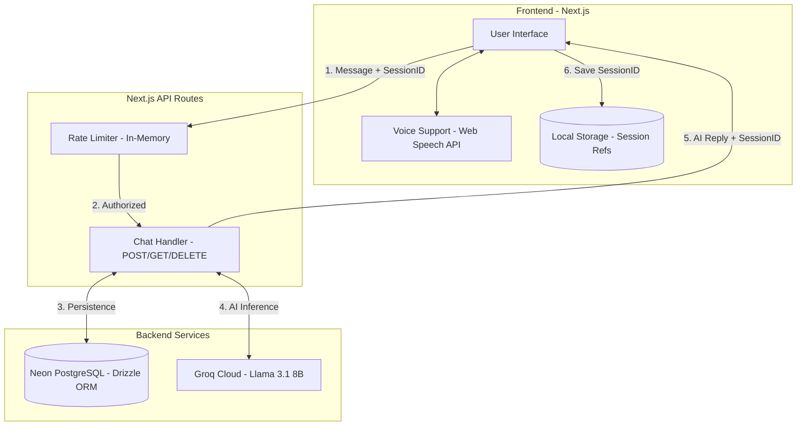
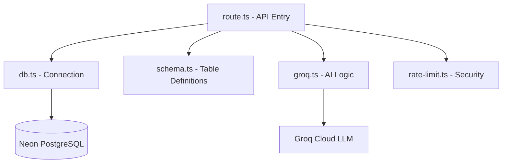

# Support-Core AI: Comprehensive Documentation

Support-Core AI is a high-performance, AI-driven customer support ecosystem designed for speed, persistence, and accessibility. Built with a cutting-edge stack featuring **Next.js 15**, **Groq (Llama 3.1)**, and **Neon PostgreSQL**, this application delivers a seamless, ChatGPT-like interface optimized for handling product-related inquiries such as shipping, orders, and returns.

Here is the comprehensive tech stack table based on your project files:

| Category | Technology | Usage in Project |
| --- | --- | --- |
| **Framework** | **Next.js 16.1.1** | Core framework utilizing App Router and React 19. |
| **Language** | **TypeScript 5** | Providing type safety across the entire codebase. |
| **LLM Engine** | **Groq SDK** | powers the `llama-3.1-8b-instant` model for rapid AI responses. |
| **Database** | **Neon PostgreSQL** | Serverless PostgreSQL for persistent session and message storage. |
| **ORM** | **Drizzle ORM** | Type-safe database schema and query management. |
| **Styling** | **Tailwind CSS v4** | Utility-first styling with PostCSS integration. |
| **AI SDK** | **Vercel AI SDK** | Core `ai` package and `@ai-sdk/groq` for LLM integration. |
| **UI Components** | **Radix UI** | Accessible primitives for dropdowns, menubars, and scroll areas. |
| **Security** | **In-Memory Rate Limiting** | Custom IP-based request throttling to prevent API abuse. |
| **Accessibility** | **Web Speech API** | Client-side voice-to-text for "hands-free" chat commands. |
| **PWA** | **Next.js PWA** | Native installability via `manifest.json` and service worker support. |

---

## 🏗 System Architecture

### High-Level Application Flow

This diagram illustrates the end-to-end communication between the client, the secure backend API, the LLM provider, and the persistent database.



### Backend Internal Structure

This diagram details the internal modularity of the backend services.



---

## 🛠 Detailed Working of the Application

The application is engineered with a "Lazy Creation" strategy to maintain a clean database state and optimal performance.

1. **Session Initiation**: When a user opens the app or clicks "New Chat," the UI resets locally, but no database entry is created yet.
2. **The First Message**: Upon sending the first message, the backend checks for a `sessionId`.
* If absent, it initializes a new **Conversation** record in the `conversations` table.
* The message is then saved to the `messages` table with a foreign key to that conversation.


3. **Context-Aware AI Processing**:
* The backend fetches the most recent 10 messages of history from the database.
* A specialized **System Prompt** is combined with this history and sent to Groq.
* The Llama-3.1-8b model generates a response constrained to support topics (Shipping, Returns, etc.).


4. **AI Persistence**: The generated reply is saved back to the `messages` table before being returned to the user.
5. **Persistence & Retrieval**: The `sessionId` is stored in the browser's `localStorage`. On page refresh, the app uses this ID to fetch the full history from the `/api/chat` GET endpoint.

---

## 🔑 API Configuration & Key Setup

To successfully deploy or run this project locally, you must configure two external services: **Neon Database** and **Groq Cloud**.

### 1. Neon PostgreSQL (Persistent Storage)

Neon provides serverless PostgreSQL that powers the persistent chat history.

* **Step A: Sign Up**: Create an account at [neon.tech](https://neon.tech).
* **Step B: Create a Project**: Create a new project (e.g., `support-core-db`) and select your closest region.
* **Step C: Get Connection String**: Copy the **PostgreSQL connection string** from your dashboard. It will look like: `postgresql://[user]:[password]@[host]/[dbname]?sslmode=require`.
* **Step D: Initialize Schema**: Execute the following SQL in the Neon **SQL Editor** to create the required tables:
```sql
CREATE TABLE conversations (
  id UUID PRIMARY KEY DEFAULT gen_random_uuid(),
  created_at TIMESTAMP DEFAULT now() NOT NULL
);

CREATE TABLE messages (
  id UUID PRIMARY KEY DEFAULT gen_random_uuid(),
  conversation_id UUID NOT NULL REFERENCES conversations(id) ON DELETE CASCADE,
  sender TEXT NOT NULL,
  text TEXT NOT NULL,
  created_at TIMESTAMP DEFAULT now() NOT NULL
);

```

* You will have to paste that string in .env ( inside inverted commas "", dont paste psql )
* Example -:
```bash
DATABASE_URL="postgresql://neondb_owner_xxxxxxx_inding=require"
```


### 2. Groq Cloud (Intelligence Engine)

Groq provides high-speed inference for the Llama 3.1 model.

* **Step A: Create Account**: Sign up at [console.groq.com](https://console.groq.com).
* **Step B: Generate API Key**: Navigate to the **API Keys** section and click **Create API Key**. Copy this key immediately.
* **Step C: Configure Model**: The app is pre-configured to use `llama-3.1-8b-instant` for ultra-low latency responses.

* Example -:
```bash
GROQ_API_KEY=gsk_xxxxxx
```

---

## 🎙 Voice Command Implementation

The application features hands-free interaction through the **Web Speech API**, enabling a more accessible user experience.

* **Implementation**: A `SpeechRecognition` object is initialized in the main chat page, configured for English (`en-US`).
* **Real-time Transcription**: As the user speaks, their voice is converted to text and automatically populated into the chat input field.
* **Smart Commands**: The system actively listens for two specific "trigger phrases":
* **"New Chat"**: Triggers a global `new-chat` event, clearing the current conversation state and `localStorage`.
* **"Send Message"**: Automatically invokes the `sendMessage()` function, sending the current transcribed text to the AI without requiring a click.


* **Compatibility**: Best supported on Chromium browsers (Chrome and Edge). Privacy-centric browsers like Brave may block this feature by default.

---

## 🛡 Security & Performance Features

### IP-Based Rate Limiting

To prevent API abuse and manage LLM costs, a custom in-memory rate limiter is applied to the `/api/chat` POST endpoint:

* **Limit**: 20 requests per minute per IP address.
* **Reset**: The request count resets automatically after a 60-second window.
* **Response**: Exceeding users receive a `429 Too Many Requests` status with a message to "Please slow down".

### Progressive Web App (PWA)

The application is fully installable as a standalone app:

* **Manifest**: Configured via `app/manifest.json` with custom icons and theme colors.
* **Install Prompt**: The `Navbar` includes a dynamic "Install" button that appears only when the browser confirms the app is installable.

---

## ⚙️ Running Locally

1. **Clone & Install**:
```bash
git clone https://github.com/Rohaz-bhalla/Support-Core.git
cd Support-Core
pnpm install

```


2. **Environment Setup**: Create a `.env` file in the root with your obtained keys:
```env
DATABASE_URL="your_neon_string"
GROQ_API_KEY="your_groq_key"

```


3. **Launch**:
```bash
pnpm dev

```


---

## 📈 Future Improvements

* **Response Streaming**: Transitioning to Server-Sent Events (SSE) for word-by-word AI typing.
* **User Authentication**: Adding Clerk or NextAuth for private, user-specific chat histories.
* **Admin Dashboard**: A high-level view for support managers to track common product issues.
